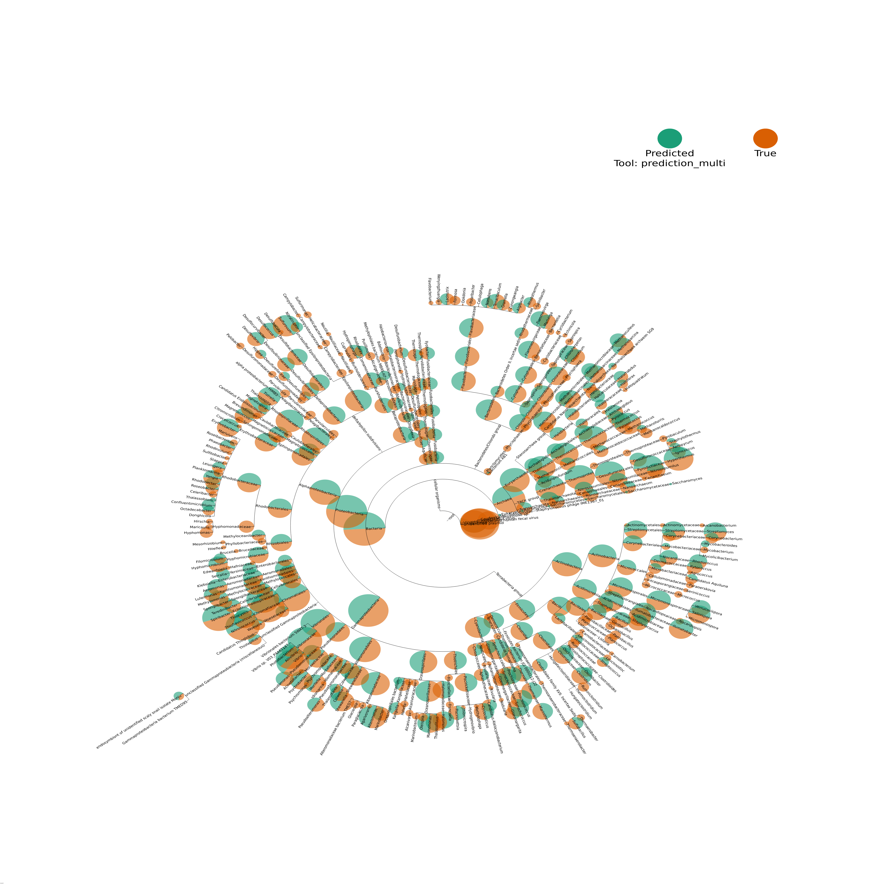

# CAMIProfilingVisualization
A collection of tools to visualize CAMI profiling outputs

# Installation
Use conda
```bash
conda config --add channels defaults
conda config --add channels bioconda
conda config --add channels conda-forge
conda create -c etetoolkit -y -n CAMIViz python=3.7 numpy  ete3  seaborn pandas matplotlib biom-format
conda activate CAMIViz
```

# Example usage
```bash
python src/profile_to_plot.py -i data/prediction_multi.profile -g data/ground_truth_multi.profile -b test -s sample_0 genus
```
This should result in a plot that looks like:

